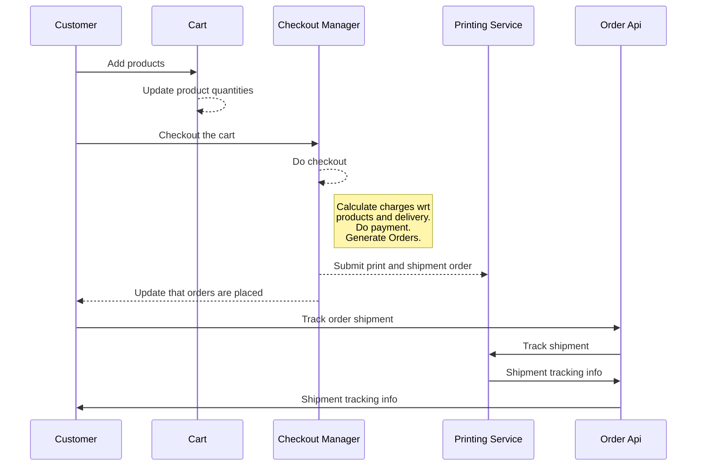
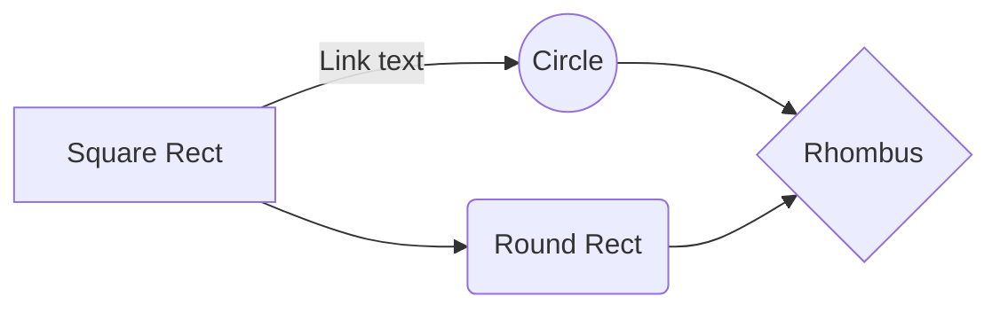

# Book Printing!

This is a web application designed to serve basic features for an On-Demand book printing software. 
Note: As of now it supports only a simple book as product, and can be extended to serve other products like Calendar, etc.


# Basic features

* Customers can browse available products
* On selection of 1 or more available products, the product will be added to the cart
* Before payment, or during product selection, user can choose book type: e-book or ‘paper book’ or both
* In the case of ‘paper book,’ the order will be placed to an external 3rd party for printing
* Shipment of the book will be done by 3rd party 
* ^Tracking mechanism needs to be created to track the status of the shipment

## Supported APIs


|Controller                |API's                                                        |
|----------------|-------------------------------------------------------------|
|Product|Supports browsing of products|
|Customer|Allows basic create-read-delete apis for the customers|
|Cart|Provides support for cart related operations like creating cart, adding/removing product, updating product quantity, clear cart and checkout|
|Order|Provides api to view orders of a customer and also track shipment|

## Class structure


## Database structure

### Major entities:

* Product
* Customer
* Cart
* Order
* Shipment
* PaymentDetails


## Checkout flow



## Tech stack used:

* SpringBoot : for building the web service
* Postgres : database
* Hibernate : ORM with SpringBootJPA
* Docker : for starting DB, printing service and book-print service in containers
* Swagger : for API documentation and usage
* Maven : build tool

## Functional components



# Running the application:
This application can be run in different ways as mentioned below.
## Using docker images directly:
The images for major components (postgres, print-service and book-print-service) are pushed to docker hub [here](https://hub.docker.com/repository/docker/ms27/book-print-demo/general). And, these can be directly fetched and run via docker. 
To do this, a shell file is already added to the project. So, anyone can just pull the [`run_docker_local_via_hub.sh`](https://github.com/manojsharma27/book-print/blob/master/docker/run_docker_local_via_hub.sh) file.

For e.g:
```
manoj@macbook docker % sh run_docker_local_via_hub.sh
>> Removing old containers


>> Starting postgres container (book-pg-cont)
Unable to find image 'ms27/book-print-demo:book-postgres' locally
book-postgres: Pulling from ms27/book-print-demo
5984ce78d275: Already exists
661057f5646e: Already exists
6fdd874b79fc: Already exists
6ffc37354234: Already exists
b31f0112ca5a: Already exists
c0cd17e70f69: Already exists
bd3c8358da64: Already exists
390a1e3d35ae: Already exists
5e835910a6d2: Already exists
3d8260f519a3: Already exists
dc403aae2863: Already exists
f8cd044bdcb6: Already exists
78056958517d: Already exists
3fb30ba3f30e: Already exists
6f5b4c2a637c: Already exists
cf0dc5789730: Already exists
Digest: sha256:7c91e6ba683c740830aa45b9eef06a6a33ce8d860b8e37fc32f7fa33e74445b1
Status: Downloaded newer image for ms27/book-print-demo:book-postgres

/usr/local/bin/docker-entrypoint.sh: running /docker-entrypoint-initdb.d/2-data.sql
INSERT 0 1


waiting for server to shut down...2021-10-10 08:01:56.423 UTC [48] LOG:  received fast shutdown request
.2021-10-10 08:01:56.424 UTC [48] LOG:  aborting any active transactions
2021-10-10 08:01:56.425 UTC [48] LOG:  background worker "logical replication launcher" (PID 55) exited with exit code 1
2021-10-10 08:01:56.426 UTC [50] LOG:  shutting down
2021-10-10 08:01:56.444 UTC [48] LOG:  database system is shut down
 done
server stopped

PostgreSQL init process complete; ready for start up.

2021-10-10 08:01:56.536 UTC [1] LOG:  listening on IPv4 address "0.0.0.0", port 5432
2021-10-10 08:01:56.536 UTC [1] LOG:  listening on IPv6 address "::", port 5432
2021-10-10 08:01:56.539 UTC [1] LOG:  listening on Unix socket "/var/run/postgresql/.s.PGSQL.5432"
2021-10-10 08:01:56.547 UTC [84] LOG:  database system was shut down at 2021-10-10 08:01:56 UTC
2021-10-10 08:01:56.550 UTC [1] LOG:  database system is ready to accept connections
>> Started PG container (book-pg-cont) with container_id f4f1460da47dd4b7a2f7d56ab8ddeb4d1fdc1855ccc5cef438b5674367602805
>> Postgres IP : 172.17.0.2


>> Starting print-service container (print-svc-cont)
Unable to find image 'ms27/book-print-demo:print-svc-img' locally
print-svc-img: Pulling from ms27/book-print-demo
0362ad1dd800: Already exists
571218f61883: Already exists
abe576d65b4c: Already exists
3a6aeb31f80a: Already exists
fa6630cd56fd: Already exists
a58c596377ca: Already exists
Digest: sha256:1ac220a74e6bf56de4e4f1f89292ff9887c76bb7a6b67525a3e8e3ca8af9d076
Status: Downloaded newer image for ms27/book-print-demo:print-svc-img

2021-10-10 08:02:07.554  INFO 1 --- [           main] com.ms.printing.bookprint.Application    : Starting Application v0.0.1-SNAPSHOT on dd8232e1d537 with PID 1 (/app/print-service.jar started by root in /)
2021-10-10 08:02:07.562  INFO 1 --- [           main] com.ms.printing.bookprint.Application    : No active profile set, falling back to default profiles: default
2021-10-10 08:02:08.677  INFO 1 --- [           main] o.s.b.w.embedded.tomcat.TomcatWebServer  : Tomcat initialized with port(s): 8080 (http)
2021-10-10 08:02:08.698  INFO 1 --- [           main] o.apache.catalina.core.StandardService   : Starting service [Tomcat]
2021-10-10 08:02:08.698  INFO 1 --- [           main] org.apache.catalina.core.StandardEngine  : Starting Servlet engine: [Apache Tomcat/9.0.24]
2021-10-10 08:02:08.764  INFO 1 --- [           main] o.a.c.c.C.[Tomcat].[localhost].[/]       : Initializing Spring embedded WebApplicationContext
2021-10-10 08:02:08.764  INFO 1 --- [           main] o.s.web.context.ContextLoader            : Root WebApplicationContext: initialization completed in 1167 ms
2021-10-10 08:02:09.259  INFO 1 --- [           main] o.s.b.a.e.web.EndpointLinksResolver      : Exposing 2 endpoint(s) beneath base path '/actuator'
2021-10-10 08:02:09.621  INFO 1 --- [           main] pertySourcedRequestMappingHandlerMapping : Mapped URL path [/docs] onto method [public org.springframework.http.ResponseEntity<springfox.documentation.spring.web.json.Json> springfox.documentation.swagger2.web.Swagger2Controller.getDocumentation(java.lang.String,javax.servlet.http.HttpServletRequest)]
2021-10-10 08:02:09.736  INFO 1 --- [           main] o.s.s.web.DefaultSecurityFilterChain     : Creating filter chain: any request, [org.springframework.security.web.context.request.async.WebAsyncManagerIntegrationFilter@43599640, org.springframework.security.web.context.SecurityContextPersistenceFilter@2cb2fc20, org.springframework.security.web.header.HeaderWriterFilter@407a7f2a, org.springframework.web.filter.CorsFilter@1f81aa00, org.springframework.security.web.authentication.logout.LogoutFilter@6ea2bc93, org.springframework.security.web.authentication.www.BasicAuthenticationFilter@6736fa8d, org.springframework.security.web.savedrequest.RequestCacheAwareFilter@723e88f9, org.springframework.security.web.servletapi.SecurityContextHolderAwareRequestFilter@495ee280, org.springframework.security.web.authentication.AnonymousAuthenticationFilter@6b6776cb, org.springframework.security.web.session.SessionManagementFilter@2a7ed1f, org.springframework.security.web.access.ExceptionTranslationFilter@4d6025c5, org.springframework.security.web.access.intercept.FilterSecurityInterceptor@589da3f3]
2021-10-10 08:02:09.809  INFO 1 --- [           main] o.s.s.concurrent.ThreadPoolTaskExecutor  : Initializing ExecutorService 'applicationTaskExecutor'
2021-10-10 08:02:09.931  INFO 1 --- [           main] d.s.w.p.DocumentationPluginsBootstrapper : Context refreshed
2021-10-10 08:02:09.951  INFO 1 --- [           main] d.s.w.p.DocumentationPluginsBootstrapper : Found 1 custom documentation plugin(s)
2021-10-10 08:02:09.972  INFO 1 --- [           main] s.d.s.w.s.ApiListingReferenceScanner     : Scanning for api listing references
2021-10-10 08:02:10.017  INFO 1 --- [           main] .d.s.w.r.o.CachingOperationNameGenerator : Generating unique operation named: handleUsingGET_1
2021-10-10 08:02:10.018  INFO 1 --- [           main] .d.s.w.r.o.CachingOperationNameGenerator : Generating unique operation named: handleUsingGET_2
2021-10-10 08:02:10.020  INFO 1 --- [           main] .d.s.w.r.o.CachingOperationNameGenerator : Generating unique operation named: handleUsingGET_3
2021-10-10 08:02:10.088  INFO 1 --- [           main] o.s.b.w.embedded.tomcat.TomcatWebServer  : Tomcat started on port(s): 8080 (http) with context path ''
2021-10-10 08:02:10.090  INFO 1 --- [           main] com.ms.printing.bookprint.Application    : Started Application in 2.828 seconds (JVM running for 3.167)
>> Started print-service container (print-svc-cont) with container_id dd8232e1d53747b7efe3c2468f863d811346bf6c44a4b6e22303b135d2324453
>> Print Service IP : 172.17.0.3


>> Starting book-print-app container (book-print-cont)
Unable to find image 'ms27/book-print-demo:book-print-img' locally
book-print-img: Pulling from ms27/book-print-demo
0362ad1dd800: Already exists
571218f61883: Already exists
abe576d65b4c: Already exists
3a6aeb31f80a: Already exists
fa6630cd56fd: Already exists
289e2da15f16: Already exists
Digest: sha256:5ec1d5b5cef5452f60a075ae1fef3a74e924eb731daca4c64df7492370635b8e
Status: Downloaded newer image for ms27/book-print-demo:book-print-img
2021-10-10 08:02:23,860 INFO  [main] org.hibernate.annotations.common.reflection.java.JavaReflectionManager: HCANN000001: Hibernate Commons Annotations {5.0.4.Final}
2021-10-10 08:02:24,145 INFO  [main] org.hibernate.dialect.Dialect: HHH000400: Using dialect: org.hibernate.dialect.PostgreSQLDialect
2021-10-10 08:02:24,214 INFO  [main] org.hibernate.engine.jdbc.env.internal.LobCreatorBuilderImpl: HHH000421: Disabling contextual LOB creation as hibernate.jdbc.lob.non_contextual_creation is true
2021-10-10 08:02:24,217 INFO  [main] org.hibernate.type.BasicTypeRegistry: HHH000270: Type registration [java.util.UUID] overrides previous : org.hibernate.type.UUIDBinaryType@58670130
2021-10-10 08:02:24,685 INFO  [main] org.springframework.orm.jpa.AbstractEntityManagerFactoryBean: Initialized JPA EntityManagerFactory for persistence unit 'default'
2021-10-10 08:02:25,553 INFO  [main] org.springframework.boot.actuate.endpoint.web.EndpointLinksResolver: Exposing 2 endpoint(s) beneath base path '/actuator'
2021-10-10 08:02:25,842 INFO  [main] springfox.documentation.spring.web.PropertySourcedRequestMappingHandlerMapping: Mapped URL path [/docs] onto method [public org.springframework.http.ResponseEntity<springfox.documentation.spring.web.json.Json> springfox.documentation.swagger2.web.Swagger2Controller.getDocumentation(java.lang.String,javax.servlet.http.HttpServletRequest)]
2021-10-10 08:02:25,933 INFO  [main] org.springframework.security.web.DefaultSecurityFilterChain: Creating filter chain: any request, [org.springframework.security.web.context.request.async.WebAsyncManagerIntegrationFilter@6e91893, org.springframework.security.web.context.SecurityContextPersistenceFilter@646811d6, org.springframework.security.web.header.HeaderWriterFilter@66ba7e45, org.springframework.web.filter.CorsFilter@3c0fbd3a, org.springframework.security.web.authentication.logout.LogoutFilter@4ba89729, org.springframework.security.web.authentication.www.BasicAuthenticationFilter@1948ea69, org.springframework.security.web.savedrequest.RequestCacheAwareFilter@cb0f763, org.springframework.security.web.servletapi.SecurityContextHolderAwareRequestFilter@2a389173, org.springframework.security.web.authentication.AnonymousAuthenticationFilter@562457e1, org.springframework.security.web.session.SessionManagementFilter@9d200de, org.springframework.security.web.access.ExceptionTranslationFilter@6be25526, org.springframework.security.web.access.intercept.FilterSecurityInterceptor@7c6442c2]
2021-10-10 08:02:26,006 INFO  [main] org.springframework.scheduling.concurrent.ExecutorConfigurationSupport: Initializing ExecutorService 'applicationTaskExecutor'
2021-10-10 08:02:26,205 INFO  [main] springfox.documentation.spring.web.plugins.DocumentationPluginsBootstrapper: Context refreshed
2021-10-10 08:02:26,233 INFO  [main] springfox.documentation.spring.web.plugins.DocumentationPluginsBootstrapper: Found 1 custom documentation plugin(s)
2021-10-10 08:02:26,286 INFO  [main] springfox.documentation.spring.web.scanners.ApiListingReferenceScanner: Scanning for api listing references
2021-10-10 08:02:26,425 INFO  [main] springfox.documentation.spring.web.readers.operation.CachingOperationNameGenerator: Generating unique operation named: deleteUsingDELETE_1
2021-10-10 08:02:26,435 INFO  [main] springfox.documentation.spring.web.readers.operation.CachingOperationNameGenerator: Generating unique operation named: handleUsingGET_1
2021-10-10 08:02:26,439 INFO  [main] springfox.documentation.spring.web.readers.operation.CachingOperationNameGenerator: Generating unique operation named: handleUsingGET_2
2021-10-10 08:02:26,440 INFO  [main] springfox.documentation.spring.web.readers.operation.CachingOperationNameGenerator: Generating unique operation named: handleUsingGET_3
2021-10-10 08:02:26,442 INFO  [main] springfox.documentation.spring.web.readers.operation.CachingOperationNameGenerator: Generating unique operation named: deleteUsingDELETE_2
2021-10-10 08:02:26,502 INFO  [main] org.apache.juli.logging.DirectJDKLog: Starting ProtocolHandler ["http-nio-8080"]
2021-10-10 08:02:26,523 INFO  [main] org.springframework.boot.web.embedded.tomcat.TomcatWebServer: Tomcat started on port(s): 8080 (http) with context path ''
2021-10-10 08:02:26,528 INFO  [main] org.springframework.boot.StartupInfoLogger: Started Application in 7.233 seconds (JVM running for 7.518)
>> Started book-print-app container (book-print-cont) with container_id 1f26075f8a25affaea67323a063cf7968feadbb49aa211348eebee5ee8ef8eda
>> Use credentials: (user/password) on -> http://localhost:8080/swagger-ui.html
manoj@macbook docker %
```

## Using source code:

To start app using source code, 
* Checkout this and the [printing-service](sdf) repo.
* Do maven install in both the applications using:
`mvn clean install -DskipTests`
* Startup postgres on local using following:
  * Go to `book-print/docker` folder
  * Build image using `docker build -f pg-dockerfile -t book-postgres .`
  * Start postgres container using `docker run -d --name book-pg -p 5432:5432 book-postgres`
  * This should start PG on localhost:5432 port.
  * Try connecting with any DB client using : 
  ```
    POSTGRES_DB=book_print_db
    POSTGRES_USER=book_user
    POSTGRES_PASSWORD=p@55w0rd!
    ```
* Go to print-service directory, and start service using `mvn spring-boot:run`
* Now, we need to start book-print service which uses Postgres DB and the print-service with following command:
`mvn  spring-boot:run`
* Once started use following credentials to access apis at: http://localhost:8080/swagger-ui.html
```
username : user
password : password
```